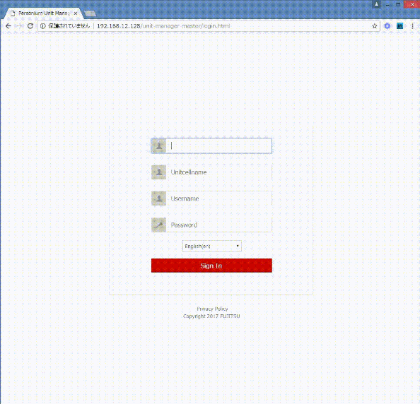

# UnitManager  
UnitManager is a GUI tool that helps you manage the unit cells of Personium.  
No installation or compilation, you only need to upload the UnitManager source files to your web server.  

## Installation    

### Prerequisites  
Before you install and use the UnitManager, make sure you have the following information ready.  

1. A valid Personium URL  
1. UnitAdminCell name  
1. UnitAdmin account  
1. Password of the UnitAdmin account 

### Procedures  
1. Upload everything in the src folder to your web server.  
1. Access the login.html file.  
E.g. Your web server is running on port 8000 and you put the files under unit-manager.  

        http://localhost:8000/unit-manager/login.html

### A simple use case  
Perform the following procedures to create a cell.  

  

1. Logon to the UnitManager.  
1. Click the [Create] button at the bottom of the Cell List side menu.  
The [Create Cell] dialog will be displayed automatically if the Cell List is empty.  
1. Click the [Next] icon on the bottom right corner of the dialog to continue.  
1. Enter the cell name.  
Profile and administrative role can also be configured at this point.  
1. Click the [Check] icon on the bottom right corner of the dialog.  

## License  

    Licensed under the Apache License, Version 2.0 (the "License");
    you may not use this file except in compliance with the License.
    You may obtain a copy of the License at

        http://www.apache.org/licenses/LICENSE-2.0

    Unless required by applicable law or agreed to in writing, software
    distributed under the License is distributed on an "AS IS" BASIS,
    WITHOUT WARRANTIES OR CONDITIONS OF ANY KIND, either express or implied.
    See the License for the specific language governing permissions and
    limitations under the License.

    Copyright 2017 FUJITSU LIMITED
