# Cell Manager 

本書ではCell Manager のセットアップ手順とインストール手順を説明します。
必要なセルにインストールして利用してください。
なお、Cell Manager を利用する場合は事前にUnit Manager がセットアップされている必要があります。
この手順では以下の情報を使用します。環境に合わせて修正してください。

* {UnitFQDN}　　 ：Personium Unit URL
* {AccessToken}　：トランスセルトークン
* {UserCell}     ：任意のユーザーセル

## Cell Manager のセットアップ手順

自身のPersonium Unit で利用可能なCell Manager を設定する手順です。

1. ブラウザにてUnit Manager にアクセスします。

    ```
    https://{UnitFQDN}/app-uc-unit-manager/__/html/login.html
    ```

1. ログイン画面に以下の要領で情報を入力し、ログインします。

    |項目|入力値|
    |---|---|
    | Login URL  | https://{UnitFQDN}/{UnitCellName}/|
    | Username　 | {UnitUserName}                    |
    | Password　 | {UnitUserPassword}                |

1. 画面左部のメニュー「Cell List」の`app-uc-unit-manager`をクリックします。

    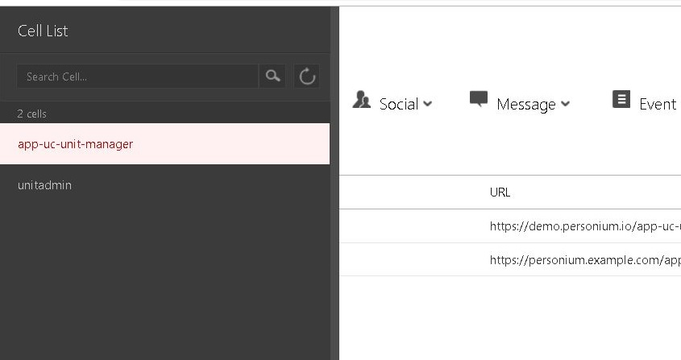

1. `Box List`の`cell-manager`をクリックします。

    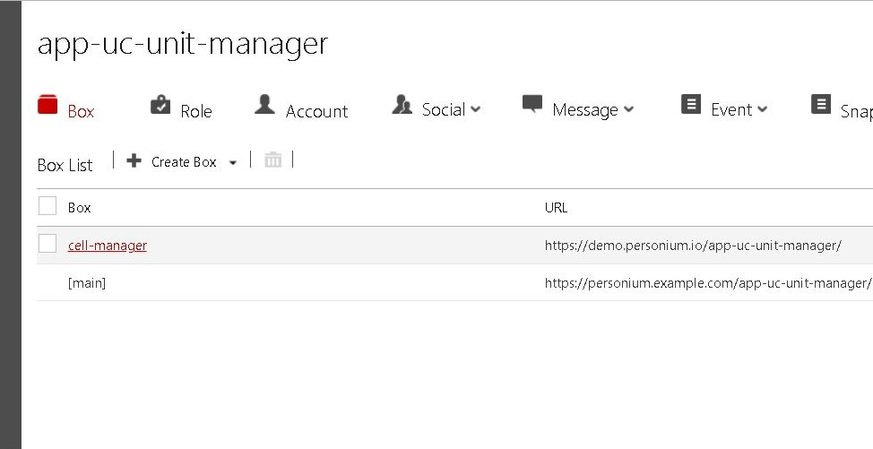

1. 鉛筆アイコンをクリックします。

    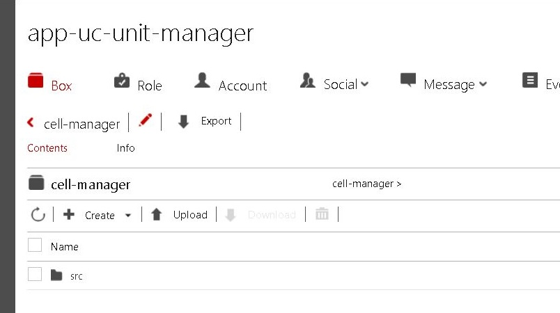

1. Edit Box 画面の`Schema URL`を変更します。  
    `https://{UnitFQDN}/app-uc-unit-manager/`となるように自身のPersonium Unit URLを指定してください。

    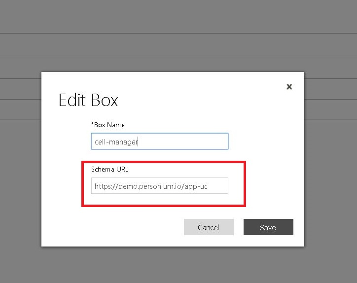

    Schema URL を修正した後"save"ボタンをクリックします。

1. cell-manager Box のsrc コレクションをクリックします。
1. login.html コレクションのチェックボックスをオンにしてdownload ボタンをクリックします。

    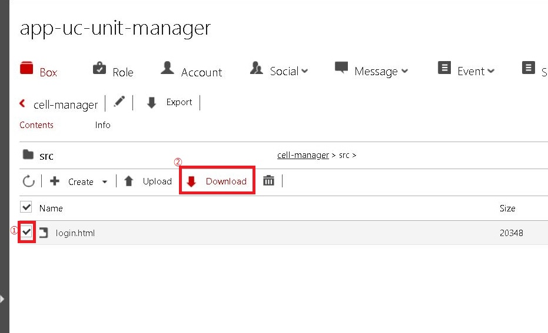

1. ダウンロードしたlogin.html をテキストエディタで編集します。
    ファイル内に記載されているFQDN`demo.personium.io`を自身のPersonium Unit のFQDNに修正します。  
1. 編集したファイルをアップロードするためUnit Manager のupload ボタンをクリックします。

    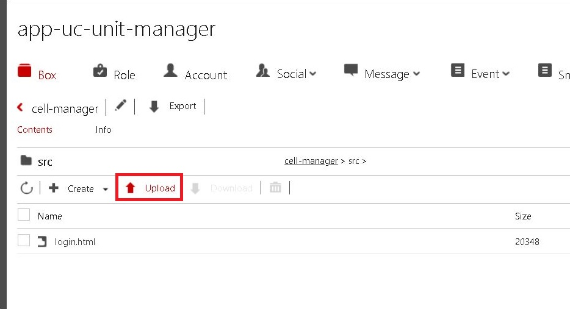

    ファイル選択ダイアログが表示されるので、login.htmlを選択してOKボタンをクリックします。

1. パン屑リストからcell-managerをクリックします。

    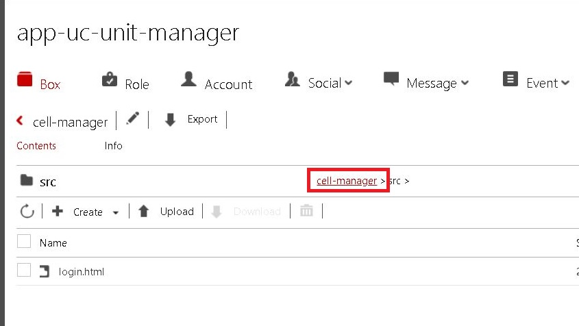

1. Exportボタンをクリックしてcell-manager ボックスをエクスポートします。

    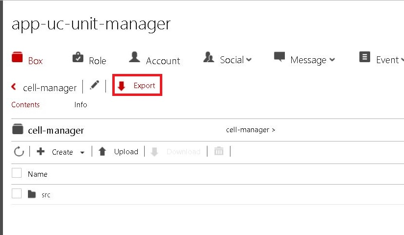

    エクスポートに成功すると配布可能なbarファイルが作成されます。  
    これでCell Managerのセットアップは完了です。
    必要なセルにbox インストールして利用してください。

## Cell Manager インストール手順

ユーザーセルに対してCell Manager をインストールする手順を説明します。 
この手順は以下の設定がされている必要があります。

    1) Cellが作成されていること
    2) Roleが作成されていること
    3) Accountが作成されており「2」のRoleが割り当ててあること
    4) 「2」のRoleにCellのroot権限が割り当てられていること
    5) Cell Manager セットアップ手順で作成したbarファイルを所持していること

1. ブラウザにてUnit Manager にアクセスします。

    ```
    https://{UnitFQDN}/app-uc-unit-manager/__/html/login.html
    ```

1. ログイン画面に以下の要領で情報を入力し、ログインします。

    |項目|入力値|
    |---|---|
    | Login URL  | https://{UnitFQDN}/{UnitCellName}/|
    | Username　 | {UnitUserName}                    |
    | Password　 | {UnitUserPassword}                |

1. 画面左部のメニュー「Cell List」のインストール対象セルをクリックします。
    この手順では`test-user`

    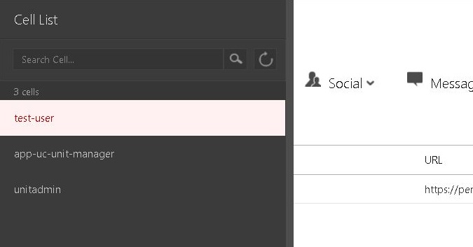

1. Create BoxプルダウンのImport Boxボタンをクリックします。

    

1. Import Box画面で①Box Nameにcell-managerと入力します。  
その後②Browseボタンをクリックし、Cell Managerセットアップ手順で作成したcell-manager.barを選択してOKボタンをクリックします。  
ファイルの選択が完了したら③Createボタンをクリックします。  

    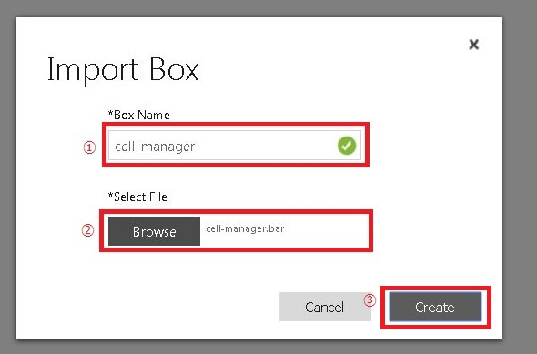

    Installation Completedが表示されるとCell Managerのインストールは完了です。  
    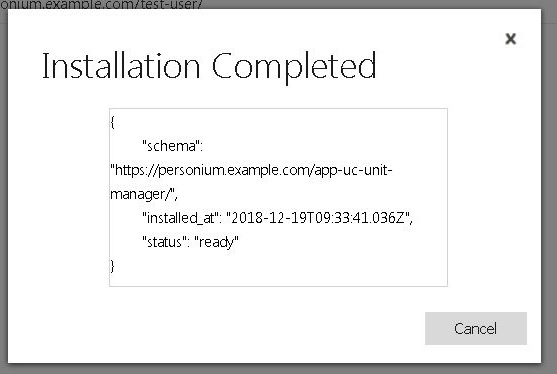

## アクセス手順  

1. 以下にアクセスします。

    ```
    https://{UnitFQDN}/{UserCell}/cell-manager/src/login.html
    ```

## 必要な情報  

1. セルの管理者アカウントのログイン情報（ID/パスワード）

## 操作方法

操作方法は[Unit Manager](./README_ja.md) と同一です。
